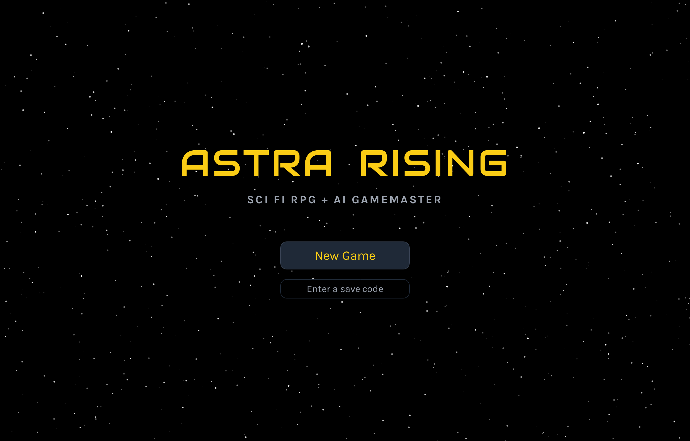
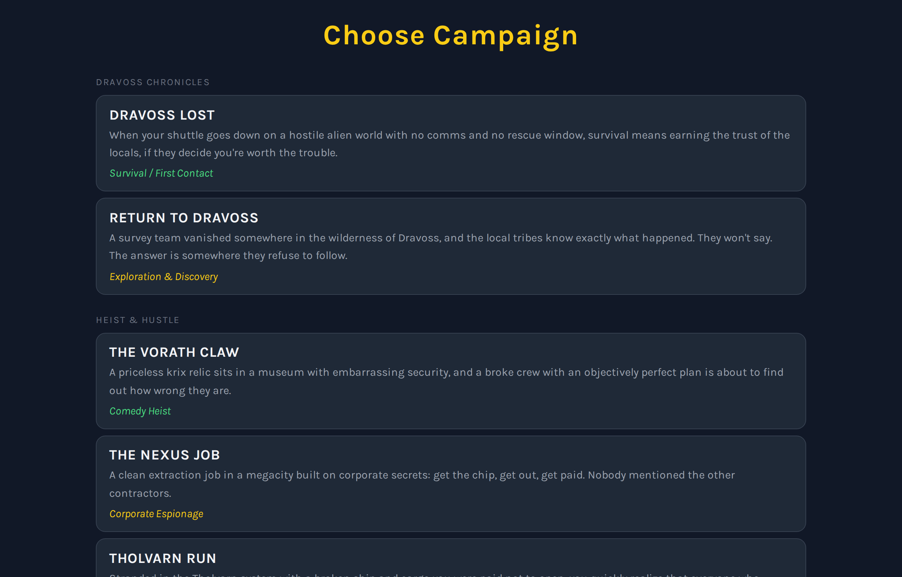

# Astra Rising

*My client work stays confidential, so I build personal projects like this to share how I think and work. I loved playing [Star Frontiers](https://en.wikipedia.org/wiki/Star_Frontiers) as a kid. When I couldn’t find a free, well-designed, mobile-friendly version with an AI dungeon master, I built this one.*

**Live Build:** [astrarising.com](https://astrarising.com)

## CONTENTS

[WHAT IS THIS?](#what-is-this)\
[DESIGN PRINCIPLES & BUSINESS VALUE](#design-principles--business-value)\
[TECHNICAL OVERVIEW](#technical-overview)\
[RUN IT YOURSELF](#run-it-yourself)\
[LICENSE](#license)

## WHAT IS THIS?

A browser-based sci-fi role-playing game with an AI game master. The server calculates the outcomes; AI tells the story. Players can leave and resume with a short save code.

It demonstrates a practical business pattern: use rules to make decisions and AI to explain them.

This repository is the real source behind the live product, published as a case study and licensed
under MIT (see [License](#license)). It is fully installable with your own API key for Groq or
Gemini.

| | |
|---|---|
|  |  |
| Session entry, with save-code resume | Campaign selection |

---

## DESIGN PRINCIPLES & BUSINESS VALUE

- Keep decisions accountable. Explicit rules determine outcomes, giving the AI a calculated result to explain.
- Use AI efficiently. Send only relevant rules, cap usage, and choose providers based on measured performance.
- Plan for provider failures. Switch providers automatically when one fails or reaches its limit.
- Let people pick up where they left off. Save codes preserve progress, a useful pattern for quotes, applications, and intake forms.
- Make testing repeatable. A scripted AI substitute checks complete workflows and failure scenarios without paid API calls.

The same separation of rules and explanation can support claims, lending, eligibility, and pricing workflows.

---

## TECHNICAL OVERVIEW

### ARCHITECTURE

```
                     [ Player action ]
                             |
              +--------------+--------------+
              |                             |
              v                             v
   [ Outcome sheet ]                 [ Game state, SQLite ]
   every roll, target, injury        character, inventory,
   rolled on the server              history, turn log
              |                             |
              +--------------+--------------+
                             |
                             v
              [ Prompt built on the server ]
                             |
                             v
              [ AI provider: Groq, then Gemini ]
              quota checked first, output capped
                             |
                             v
              [ One AI call narrates the outcome ]
                             |
                             v
              [ Server applies the sheet's numbers ]
```

### HOW A TURN WORKS

1. **The browser sends the action:** the turn number and the player's text or chosen option. Game
   state stays on the server. (`server.js`, `POST /api/turn`)
2. **The server rolls first.** Every check is rolled with `crypto.randomInt` against targets from
   the rules engine, and the result is written as outcome words such as "HIT, target DOWN".
   (`server/services/outcomeSheet.js`, `dice.js`, `ruleEngine.js`)
3. **One AI call narrates it.** The server builds the prompt from stored state, and the AI describes
   the outcome. If a reply comes back unreadable, the server retries once on the other provider. Output is
   capped at 4,096 tokens. (`server/services/promptBuilder.js`)
4. **The server applies the numbers.** Damage, energy spent and every other change come from the
   sheet; the AI's text describes the result. (`server/services/resolveTurn.js`)
5. **A retry replays the same result.** Each turn is saved to a turn log before the AI answers, so a retried
   or duplicate request replays the same result.

### KEY DECISIONS

- **The server owns game state.** It is the single writer, and the browser sends actions.
  (`server/services/stateStore.js`)
- **The old client-driven AI relay is retired.** `POST /api/chat` returns `410 Gone`.
- **Rules are sent by relevance.** Each prompt carries the rules that turn needs, within a design
  budget of about 800 tokens (a target set in code).
  (`server/services/promptRulesInjector.js`)
- **Games run with every ruleset loaded.** New games and turns check the rules first and return
  `503 RULES_NOT_LOADED` until all of them are loaded.
- **Rules stay on the server.** They live in `data/rules/`, outside the web folder.
- **One format for every AI provider.** Groq and Gemini both use the OpenAI chat format, so adding a
  third is a single registry entry. (`server/services/aiProviders.js`)
- **Simple stack.** Node, Express 4 and SQLite in WAL mode, accessed synchronously through
  `better-sqlite3`, so the data layer is plain synchronous code.
- **The frontend ships as written.** `public/app.js` is plain `React.createElement` calls, served
  directly.
- **Sessions use save codes.** A session is a token plus a ten-character save code.

### CHOOSING THE AI

Provider choice was decided by measurement. `planning/experiments/model-bakeoff/` holds the harness,
prompt and raw results for **46 models** across OpenAI, Google and Groq, each given the same game
turn. It was measured before 2026-09-03 on the turn prompt of that time, so it shows which models are
fast and reliable. Of the 46, 37 answered in the required format, 4 answered in the wrong format,
and 5 returned errors.

| Model | Latency | Note |
|---|---|---|
| GPT-5, GPT-5-mini | 26.9s, 23.3s | Too slow for a game turn |
| GPT-5.1 through 5.6, full size | 4.2s to 16.5s | Still too slow |
| GPT-5.4-mini, GPT-5.4-nano, GPT-4.1-mini | 2.1s to 3.7s | Fast, valid format |
| **llama-3.3-70b-versatile** | 1.0s | First choice; later retired by Groq, replaced by `openai/gpt-oss-120b` |
| gemini-2.5-flash-lite | 1.1s | Fast, valid format |
| **gemini-2.5-flash** | 3.7s | Chosen as backup |

**Why Groq first, Gemini as backup:**

- **Groq is faster and allows more.** Its free tier for `openai/gpt-oss-120b` is 1,000 requests and
  200,000 tokens a day (Groq's published limits, checked 2026-09-30).
- **Gemini covers bursts and outages.** Its free tier for `gemini-2.5-flash` is 20 requests a day
  (measured from a live limit error, 2026-09-30).
- **Rough capacity:** an early-game turn measured about 2,000 tokens (2026-09-30), so Groq's
  allowance is roughly 50 to 100 turns a day. An estimate: turns grow as a game goes on.

### SECURITY AND COST

- **Six rate limits,** each adjustable in `.env`: turns per session (100 an hour), turns per IP
  address (150 an hour), new sessions per IP (20 an hour), turns per session per day (300),
  checkpoints (200 an hour) and module routes (60 an hour).
- **Quota checked before every AI call.** The server tracks each provider's daily allowance. When
  every provider is used up, players get a clear message with the time it resets. (`server.js`, `exhaustedPayload`)
- **Security headers** via `helmet`. The content security policy is switched off so the page's
  inline script and style block can run.
- **Runs on free tiers.** A demo late in the day can reach the daily limit and show the quota message.

### HOW IT WAS PLANNED AND TESTED

- **Risks and sequencing:** `planning/PLAN.md`, sections A and B.
- **Decisions with reasons and test counts:** `planning/CHANGES.md`, one entry per change.
- **API and state contracts, packet dependency graph:** `planning/prd/PRD-v2.md`, sections 28 to 30.
- **Which rules are followed exactly and which are simplified:** `planning/prd/PRD-v3.md`,
  section 11.
- **Tests, in two tiers:**
  - `npm test`: 220 tests. Every test that starts the app points it at a local stand-in AI, so the
    suite runs offline even with a `.env` holding real keys. (`tests/noRealProvider.test.js`)
  - `npm run qa`: 168 checks. A scripted stand-in AI drives a real browser through the whole game
    at phone and desktop size. The run includes combat, a checkpoint replay that proves a replayed turn
    returns the same result, and eight kinds of provider failure, each of which must show a clear message and a
    retry.

### TRADE-OFFS

- **SQLite** ties the app to one machine, in exchange for a simple, fast data layer and test suite.
- **Rules load at startup,** so a rules edit needs a restart.
- **Tests run one at a time,** because they share one database.
- **`build.js`** is the retired build step, kept in the repo for reference.

---

## RUN IT YOURSELF

**What you need**

- Node 20 or later
- At least one free AI key: Groq (console.groq.com) or Gemini (Google AI Studio). Both is best:
  Groq runs first and Gemini is the backup.

**1. Get the code**

```
git clone https://github.com/kgsubs/astra-rising-public.git
cd astra-rising-public
npm ci
```

**2. Check it works (runs offline)**

```
npm test
```

**3. Add your settings**

```
cp .env.example .env
```

Then fill in these lines in `.env`:

| Setting | What goes there |
|---|---|
| `GROQ_API_KEY` | Groq console: API Keys |
| `GEMINI_API_KEY` | Google AI Studio: Get API key |

**4. Set up the database**

The game creates its SQLite database automatically the first time it starts.

**5. Start it**

```
npm start
```

Open http://localhost:3500.

**6. Run the browser test suite (optional)**

```
npm run qa
```

This needs the `agent-browser` command-line tool installed first; see `qa/README.md`.

**Deploying to a server:** `planning/deploy/` has the reverse-proxy config, the service file and a
setup script, with the domain and user as placeholders.

---

## LICENSE

MIT. See `LICENSE`. Bundled fonts and images carry their own terms; see `THIRD_PARTY_NOTICES.md`.
