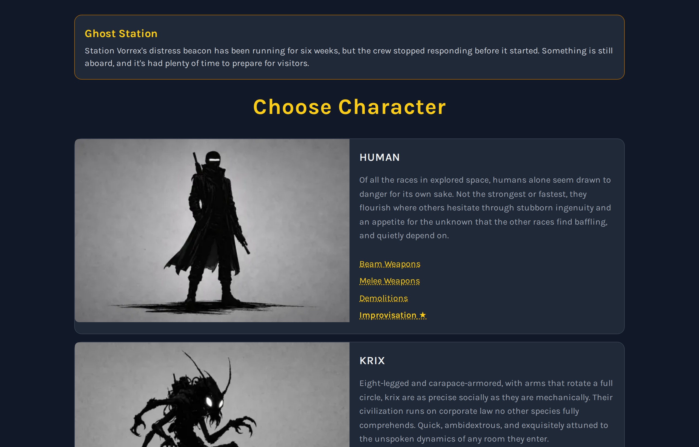
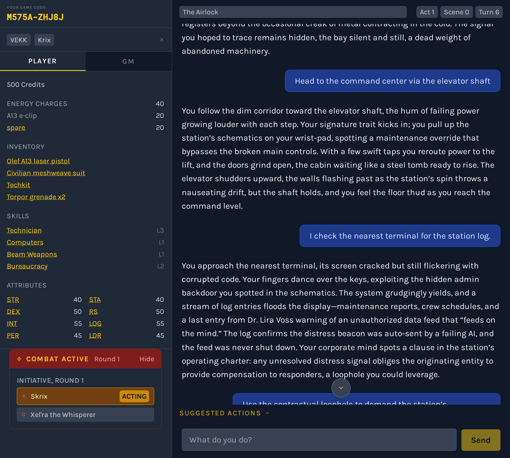
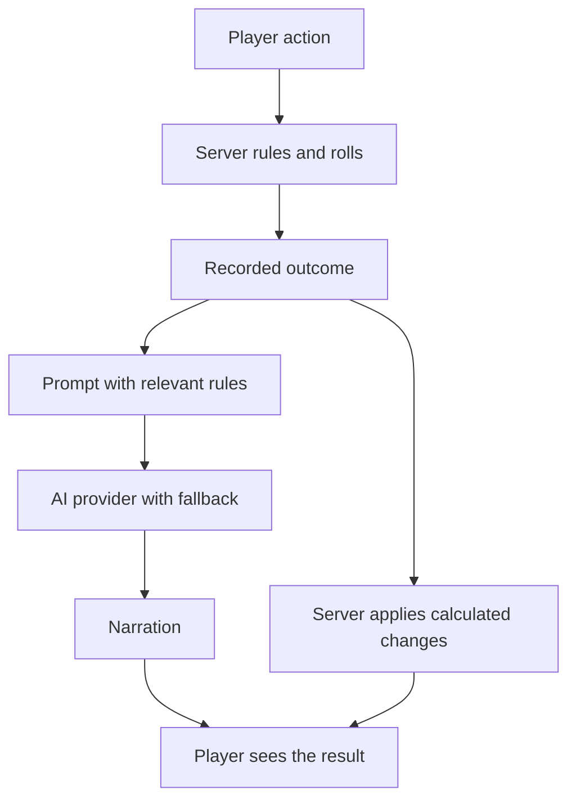

# Astra Rising

*My client work stays confidential, so I build personal projects like this to share how I think and work. I loved playing [Star Frontiers](https://en.wikipedia.org/wiki/Star_Frontiers) as a kid. When I couldn’t find a free, well-designed, mobile-friendly version with an AI game master, I built this one.*

**[Try the live app](https://astrarising.com)**

## Contents

- [What is this?](#what-is-this)
- [Design principles & business value](#design-principles--business-value)
- [Key engineering decisions](#key-engineering-decisions)
- [Architecture](#architecture)
- [Validation & limitations](#validation--limitations)
- [Technical reference](#technical-reference)
- [Run it yourself](#run-it-yourself)
- [License](#license)

## What is this?

A browser-based sci-fi role-playing game with an AI game master. The server calculates the outcomes; AI tells the story. Players can leave and resume with a short save code.

It demonstrates a practical business pattern: use rules to make decisions and AI to explain them.

| | |
|---|---|
|  |  |
| Start a session or resume with a save code | Choose a campaign |
|  |  |
| Choose a character | A game in progress, with the character sheet and combat underway |

This is the source behind the live product, published as an installable case study under the MIT license.

## Design principles & business value

- **Keep decisions accountable.** Explicit rules determine outcomes, giving the AI a calculated result to explain.
- **Use AI efficiently.** Send only relevant rules, cap usage, and choose providers based on measured performance.
- **Plan for provider failures.** Switch providers automatically when one fails or reaches its limit.
- **Let people pick up where they left off.** Save codes preserve progress, a useful pattern for quotes, applications, and intake forms.
- **Make testing repeatable.** A scripted AI substitute checks complete workflows and failure scenarios without paid API calls.

The same separation of rules and explanation can support claims, lending, eligibility, and pricing workflows.

## Key engineering decisions

### Keep outcomes under server control

The server owns game state and calculates rolls, targets, damage, and other numerical changes. The AI receives those results and narrates them.

This keeps authoritative state independent of the model’s arithmetic or interpretation of the rules. A stored turn log also lets retried requests return the same recorded result.

The earlier client-driven AI relay was retired as part of this separation.

[Outcome calculation](server/services/outcomeSheet.js) · [Rules engine](server/services/ruleEngine.js) · [State updates](server/services/resolveTurn.js)

### Give the model only the rules it needs

Each turn includes relevant rules rather than the full rules library, with a target budget of approximately 800 tokens for that material.

This limits prompt size while keeping the applicable rules close to the task. The budget is a design target, not a guarantee for every request.

[Rules selection](server/services/promptRulesInjector.js) · [Prompt construction](server/services/promptBuilder.js)

### Choose providers through measurement

An initial comparison tested 46 models on the same game turn. Of those, 37 returned the required format, four returned the wrong format, and five produced errors.

That experiment informed provider selection using response time and format reliability. The application now uses Groq first and Gemini as backup, behind a shared interface.

The comparison reflects the prompt and models available at the time. It is evidence of the selection process, not a current ranking or a complete assessment of narrative quality.

[Experiment and raw results](planning/experiments/model-bakeoff/) · [Provider implementation](server/services/aiProviders.js)

### Put boundaries around cost and failure

The server checks provider quotas before calling AI, caps output, and applies request limits. If a provider fails or returns an unreadable response, the application can try the alternative.

When all provider allowances are exhausted, the player receives a clear message showing when usage resets.

This keeps the demo within configured limits while making capacity constraints visible.

[Request handling and quota controls](server.js)

### Keep the system simple enough to inspect

Node, Express, and SQLite keep the application compact. The frontend is served directly, and sessions resume through a ten-character save code.

The trade-off is explicit: SQLite ties this implementation to one machine. That simplicity suits the current build, but changes the work required to scale it across servers.

[State storage](server/services/stateStore.js) · [Frontend](public/app.js)

## Architecture



### How a turn works

1. **Receive the action.** The browser sends the player’s action and turn number. Game state stays on the server.
2. **Calculate and record the outcome.** The rules engine sets targets, the server rolls the checks, and the turn log preserves the result.
3. **Generate the narration.** The model receives the outcome and relevant context. An unreadable reply triggers one retry through the other provider.
4. **Apply the calculated changes.** Damage, energy use, and other state changes come from the server’s outcome sheet.
5. **Handle retries consistently.** Duplicate or retried requests replay the recorded result.

[Rolls](server/services/dice.js) · [Outcome sheet](server/services/outcomeSheet.js) · [Prompt builder](server/services/promptBuilder.js) · [Turn resolution](server/services/resolveTurn.js)

## Validation & limitations

### What is tested

Four suites check different levels of behavior:

| Suite | Coverage |
|---|---|
| **220 tests** | Application and service behavior, using a local AI substitute whenever the app starts |
| **189 browser QA checks** | Complete gameplay at phone and desktop sizes, combat, checkpoint replay, provider-failure scenarios including the retry on the other provider, and that the title font and starfield really render at four screen widths |
| **Real-AI evals** | Scripted situations played against the real model through the server's own routes: combat starts when anyone attacks, stories carry no raw numbers, out-of-character questions change nothing, replies parse |
| **Live smoke check** | One real game and one real turn on the live site, plus the render checks, after every deploy and daily |

The replay checks verify that a repeated turn returns the same result. Failure checks verify clear messages and retry behavior.

The first two use a scripted AI substitute, so they run without paid AI calls. They verify application behavior; they do not establish the quality of every response from a live model. The evals and the smoke check use the real providers, stop cleanly when the free allowance runs out, and report that as a skip rather than a failure.

[Tests](tests/) · [No-real-provider check](tests/noRealProvider.test.js) · [Browser QA](qa/README.md)

### Current limitations

- **Demo capacity is limited.** The app operates within free provider allowances and can reach its daily limit.
- **Narration remains model-generated.** Server control protects the numerical state; it does not guarantee that every sentence is correct.
- **The database is local.** SQLite simplifies the build but ties it to one machine.
- **Rules load at startup.** Changing them requires a restart. New games and turns are blocked until all rulesets have loaded.
- **Tests run sequentially.** They share a database.
- **Some game rules are simplified.** Those choices are documented in the specification.

[Exact and simplified rules](planning/prd/PRD-v3.md) · [Build decisions and changes](planning/CHANGES.md)

### Planning and build evidence

The repository preserves the original risk analysis, implementation sequence, API contracts, and subsequent decisions. These documents show how the build developed, including changes from the initial plans.

[Risks and sequencing](planning/PLAN.md) · [API and state contracts](planning/prd/PRD-v2.md) · [Change record](planning/CHANGES.md)

## Technical reference

<details>
<summary>Stack and implementation map</summary>

| Component | Implementation |
|---|---|
| Backend | Node and Express 4 |
| Database | SQLite in WAL mode through `better-sqlite3` |
| Frontend | React calls served directly from `public/app.js` |
| AI providers | Groq first, Gemini as backup |
| Provider interface | Shared OpenAI-compatible chat format |
| Sessions | Session token and ten-character save code |
| Rules | Server-side files in `data/rules/`, outside the public web folder |
| Testing | Local scripted AI substitute and browser QA |

| Location | Purpose |
|---|---|
| [server.js](server.js) | API routes, request limits, and quota handling |
| [server/services/stateStore.js](server/services/stateStore.js) | Authoritative game state |
| [server/services/ruleEngine.js](server/services/ruleEngine.js) | Rules and targets |
| [server/services/outcomeSheet.js](server/services/outcomeSheet.js) | Calculated turn outcomes |
| [server/services/resolveTurn.js](server/services/resolveTurn.js) | Applying state changes |
| [server/services/promptBuilder.js](server/services/promptBuilder.js) | Narration requests |
| [server/services/promptRulesInjector.js](server/services/promptRulesInjector.js) | Relevant-rule selection |
| [server/services/aiProviders.js](server/services/aiProviders.js) | Provider registry |
| [planning/](planning/) | Specifications, experiments, and build history |

The retired `POST /api/chat` endpoint returns `410 Gone`. The old `build.js` remains as a historical reference.

</details>

<details>
<summary>Usage controls and security configuration</summary>

Default request limits are configurable in `.env`:

| Limit | Default |
|---|---|
| Turns per session | 100 per hour |
| Turns per IP address | 150 per hour |
| New sessions per IP address | 20 per hour |
| Turns per session per day | 300 |
| Checkpoints | 200 per hour |
| Module-route requests | 60 per hour |

The server tracks daily provider allowances and checks them before every AI call. Output is capped at 4,096 tokens.

Security headers use `helmet`. Content Security Policy is disabled to accommodate the current inline scripts and styles; that is a limitation of this implementation.

</details>

<details>
<summary>Provider capacity snapshot: September 30, 2026</summary>

These figures describe the recorded demo configuration, not permanent provider guarantees.

| Provider / model | Recorded allowance | Basis |
|---|---|---|
| Groq / `openai/gpt-oss-120b` | 1,000 requests and 200,000 tokens per day | Published limits checked September 30, 2026 |
| Gemini / `gemini-2.5-flash` | 20 requests per day | Observed live limit error on September 30, 2026 |

An early-game turn measured approximately 2,000 tokens, giving an estimated 50–100 turns per day within the Groq token allowance. Longer sessions increase context size and can reduce capacity.

The initial model comparison favored `llama-3.3-70b-versatile` for speed. After Groq retired that model, the primary configuration changed to `openai/gpt-oss-120b`.

[Original comparison and raw measurements](planning/experiments/model-bakeoff/)

</details>

## Run it yourself

You need Node 20 or later and an API key for Groq or Gemini. Configure both to exercise provider fallback.

### 1. Install and test

```bash
git clone https://github.com/kgsubs/astra-rising-public.git
cd astra-rising-public
npm ci
npm test
```

Tests run offline using the local AI substitute.

### 2. Configure providers

```bash
cp .env.example .env
```

Set one or both keys:

| Variable | Source |
|---|---|
| `GROQ_API_KEY` | [Groq Console](https://console.groq.com) |
| `GEMINI_API_KEY` | [Google AI Studio](https://aistudio.google.com) |

Groq runs first; Gemini provides backup.

### 3. Start the app

```bash
npm start
```

The app creates its SQLite database on first start. Open http://localhost:3500.

### 4. Run browser QA

```bash
npm run qa
```

This requires the `agent-browser` command-line tool. See [QA setup](qa/README.md).

**Server deployment:** see [planning/deploy/](planning/deploy/) for reverse-proxy configuration, the service file, and a setup script. Replace the domain and user placeholders before use.

## License

MIT. See [LICENSE](LICENSE).

Bundled fonts and images carry their own terms. See [THIRD_PARTY_NOTICES.md](THIRD_PARTY_NOTICES.md).
